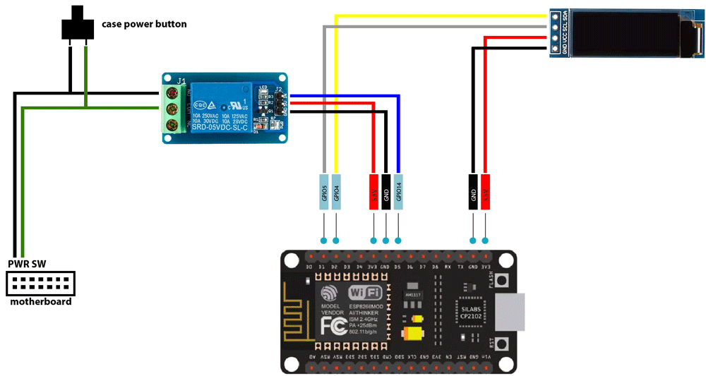
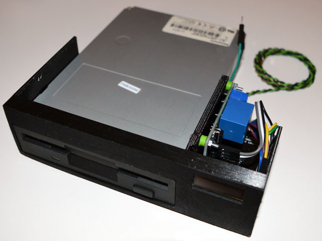

# ESP8266 Power Remote Control

This project enables you to control the power button of your PC remotely.

An ESP8266 module with a relay is installed between the power button and the motherboard header. 
The physical power button is still functional, while the ESP8266 module can be remotely controlled to "push" the button. 
The advantage of this approach compared to Wake on LAN is that you can also power off the PC - even if the operating system is unresponsive.

Features:

- Web UI
- RESTful API
- Optional basic authentication
- Support for display with an SSD1306 controller
- Can be used with the reset button instead of the power button if wanted

Improvement for the future: the API could read the power status from the power LED header, for example

## Required hardware

- An ESP8266 module, NodeMCU v2/3 used in development (similar modules should be easy to adapt)
- A 3.3VDC/5VDC relay module
- A display with with an SSD1306 controller (optional, you can remove the code that controls the display)
- Wires

### Schematic

Connecting the relay to the ESP8266:

- 3.3V in ESP --> VCC in relay
- GND in ESP --> GND in relay
- D5 / GPIO14 in ESP --> IN in relay

Connect the power button and the motherboard header to NO (Normally Open) and COM (Common) in the relay.

Connecting the display to the ESP8266:

- D1 / GPIO5 in ESP --> SCL / SCK in display
- D2 / GPIO4 in ESP --> SDA in display
- GND in ESP --> GND in display
- 3.3V in ESP --> VCC / VOD in display

Tip: if your motherboard supports always on USB power, you can connect the ESP8266 module into an internal USB header for a clean setup



## Installing the software

Use the [PlatformIO](https://platformio.org/) Visual Studio Code editor / extension. 

The configuration variables are set in the beginning of the main.cpp. The important settings are:

- WIFI_SSID = your wireless network access point's SSID
- WIFI_PASSWORD = the password for the wireless network
- WWW_AUTH_ON = require username and password when calling the API (values true or false)
- WWW_USERNAME, WWW_PASSWORD = if WWW_AUTH_ON is set to true, the basic auth username and password
- SCREEN_ROTATION = the rotation/orientation of the display (value 2 means the display is installed upside down)
- RELAY_PIN = the pin ID into which the relay IN is connected to (value 14 corresponds to pin D5 on a NodeMCU V3)

Finally open the PlatformIO extension tab and run the "Upload and Monitor" task.

Tip: currently there is no setting for static IP - DHCP is being used. 
Once your DHCP server serves the ESP8266 module, you can convert that into a reservation, or copy the MAC address and assign it a completely new address.

## Using the software

When the PlatformIO monitoring is active, you can see the IP in the terminal. The IP is also visible on the display.

You can access the application with a web browser by navigating to its IP address (port 80 by default).

The front page lists the following curl commands for using the API:

```
curl -X POST -u "username:password" http://ip-address/short_press
curl -X POST -u "username:password" http://ip-address/long_press
```

If the authentication is disabled, the -u parameter can be omitted. 

By default the short press presses the power button for 1,5 seconds and the long press is for 6 seconds (force shut down).


## 3D model for 5.25" bay adapter

The "3d" directory contains models made by Raimo Raitahila for 3D printing an adapter for installing the hardware into a 5.25" bay. In addition to attaching the ESP8266 module, relay and display, the adapter has a 3.5" slot for a memory card reader, floppy drive, etc.

